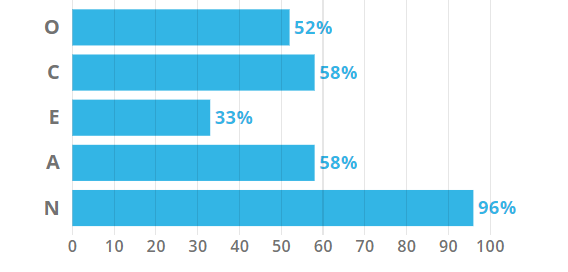
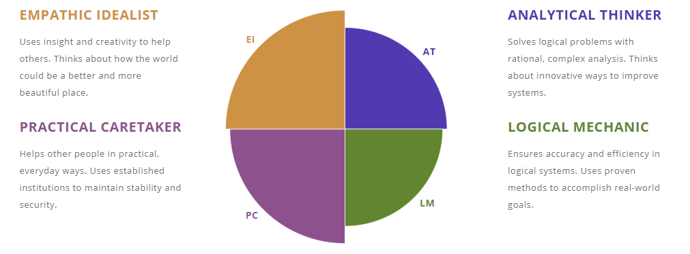
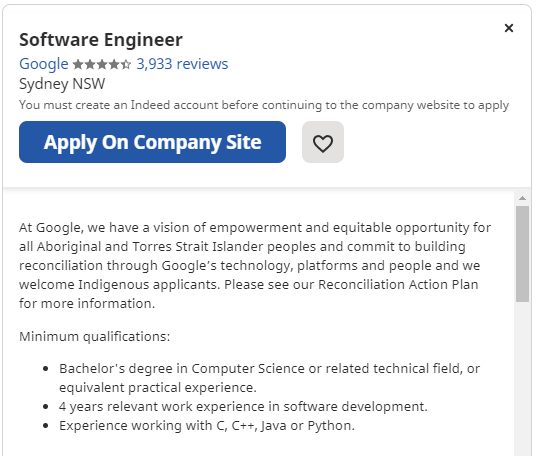
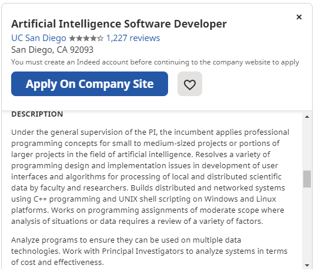

<!DOCTYPE html>
<html>
<body>

  <h1>Amy Hyde</h1>
  <h3>Fun Facts</h3>
  
My name is Amy Louise Hyde, I was born on the 14th of September and I am currently 20 years old!

  
Some facts about me: I enjoy playing football (soccer) and my favourite team is Manchester City. My favourite colour is orange. And I LOVE anything to do with curry; naan breads, onion bhajis, papadams - the works!

  <h1>Personality Test Results</h1>
  
After taking the Myers-Briggs Test, I was declared an 'Architect', with the personality type being: INTJ-T.

  
With this personality type, my strengths include:
      
Challenges where a rational thinking strategy is required

      
Tasks that provide the opportunity to work independently

      
And, environments that allow my curiosity to take over.

  
Overall, I think that these attributes relate to my personality as I love working on assignments and challenges that allow me to work individually. However, I'll never say no to a challenge - even if that means stepping out of my comfort zone and working in a group environment.

  
I like to think of myself as a very curious person, and feel as though I need an answer to every question. This makes philosophical questions really hard to think about!

  
According to the Myers-Briggs Test, the weaknesses of an INTJ-T personality type include: being overly critical of themselves, and not allowing emotions getting in their way.

  
There were a few others listed, but these were the weaknesses that I felt I related to the most.

  
After taking the VARK Online Learning Style Questionnaire, it was revealed that my preferred learning style is Multimodal.

  
This means that I prefer to learn via the use of graphs, diagrams, maps, listening, and discussing.

  
I feel as though this is correct in relation to myself, as I can drift off easily and prefer to work in a stimulating learning environment that allows me to fully engage in the topic.

  
For the third and final test, I decided to take the Big Five Test by Truity. Through this test the five major dimensions of personality were measured and presented. The five major dimensions being: Openness, Conscientiousness, Extraversion, Agreeableness, and Neuroticism (or OCEAN for short).

  
Below are my results from this test in diagram form

  
Overall, I feel as though I relate to all the results in one way or another.

  
In a group scenario, I would have to attempt to exert myself. I feel as though I am relatively introverted, and I would have to try not to be so reserved in order to work successfully with others.

  <h1>Interest in IT</h1>
  
I have had an interest in IT for as long as I can remember, whether it be having an idea for an app (that I never went through with), wanting to work for a big tech media company, or develop a new video game.

  
But it was not until this year where I started to pursue my interest in the IT field. I never even thought that working in this area was an option given the fact that I am female. That sounds stupid now, but growing up most of the successful people in the field were male: Bill Gates, Steve Jobs etc.

  
Although after a year studying a course I had no interest in, I realised that I may as well give it a go. What can go wrong?

  
Introduction to IT is the second topic that I have taken at RMIT this year. Last study period, I studied Introduction to Programming which I ended up really enjoying and sparked my interest even more than I thought it could.

  
As previously mentioned, I undertook a year of another course at my local university and quickly realised that it was not for me. After some searching through the hundreds of courses available, I came across Computer Science - and thought the course outline sounded really interesting.

  
However, because I did not take Math Methods in year 12 I was not eligible for a transfer straight away. So as well as topics at RMIT I am taking a couple Maths topics elsewhere in the hopes of transferring into Computer Science in the new year.

  
During this topic, I hope to learn the basics of Information Technology and get a head start in my studies next year

  <h1>Ideal Job</h1>
  
My ideal job is to work as a Software Developer/Aritificial Intelligence Engineer on a project that is working on creating the future of technology.

  
Below are a few screenshots and links to a few examples of the types of jobs I hope to pursue:

  
Apart from the fact that I have an interest in the artifical intelligence field, these roles appeal to me as I would like to be apart of something big. Whether that be something as simple as participating in an AI project for a company that is not well known on the grand scheme of things, or working on a project that makes history. Either way, I would love to work in a role that I feel proud and look forward to doing every day, and feel a sense of accomplishment when finished.

  
Despite the fact that these roles are in areas which are still growing, the fields are very competitive so it will be hard to gain the experience needed. However, maybe in four or five years I will be applying for a job that, today, has not even been invented yet!

  
These jobs would require a knowledge of one or multiple programming languages. I am currently familiar with Python, but would like to familiarise myself in either Java or C++ (or both!). These roles would also require a degree in Computer Science at least, which I soon hope to make a start on.

  
In order to gain the skills and experiences that are needed for these roles I will have to work tirelessly in order to stand out amongst my peers. I will need to do this in order to hopefully gain an intership or post-graduate role in order to gain the experience that is required for a company that is developing AI.

